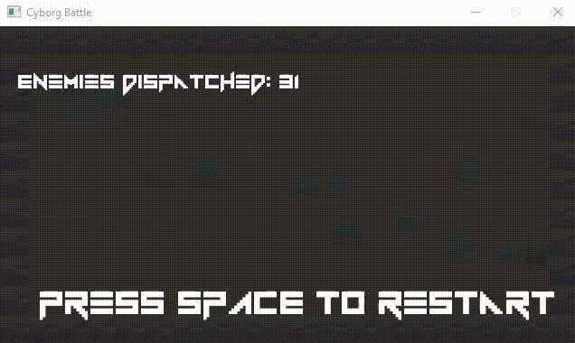

# HackNSlashCyborg

A hack' n slash game made in C++ with the SDL2 library.
Game Installer available here : <https://bit.ly/2T1kvMV>
(To compile the project, you need to have the sdl2 library located at C:\sdl2)
Made thanks to the assets and courses from Matthew Carr (https://twitter.com//2HitMatt)
https://www.udemy.com/hack-n-slash-sdl2/learn/v4/overview

UPDATES :
  - (16/01/2019) : Add a camera with interpolation that smoothly follows the player around the stage :
  
  
   - (17/01/2019) : Add a new type of enemy (Grob) that just walk towards the player and hurt him if collided with
  

  - (17/01/2019) : Add a boss battle encounter after 3 successful waves of enemies slained
  
  
   - (17/01/2019) : Add a UI health bar for the boss and increased the player's health amount
  
  
COMMAND LIST :
  - Spacebar : Start the game / Restart the game 
  - Escape key : Quit the game
  - "W" key : Attack
  - "X" key : Dodge/Sprint with invicinbility frame
  - "up arrow" key : Move Up
  - "down arrow" key : Move Down
  - "right arrow" key : Move Right
  - "left arrow key" : Move Left

Credit:
Course programming, curriculum design, and lectures: Matthew Carr

Project made with C++11 and Visual Studio 2015.
The executable file will be included in the final commit.

To compile this project you need to install the following libraries (NOTE : if you're using Visual Studio download the "Development Libraries" version of those libraries, those are the only ones containing the .lib dependencies needed to compile) :
  - SDL 2.0 library : 
       available here : https://www.libsdl.org/download-2.0.php
       follow this guide to install it : https://www.wikihow.com/Set-Up-SDL-with-Visual-Studio-2017
  - SDL image library 2.0 :
       available here : https://www.libsdl.org/projects/SDL_image/
       (follow the same steps as above to install it)
  - SDL ttf 2.0 :
       available here : https://www.libsdl.org/projects/SDL_ttf/
       (follow the same steps as above to install it)
  - SDL mixer 2.0 :
       available here : https://www.libsdl.org/projects/SDL_mixer/
       (follow the same steps as above to install it)
  
